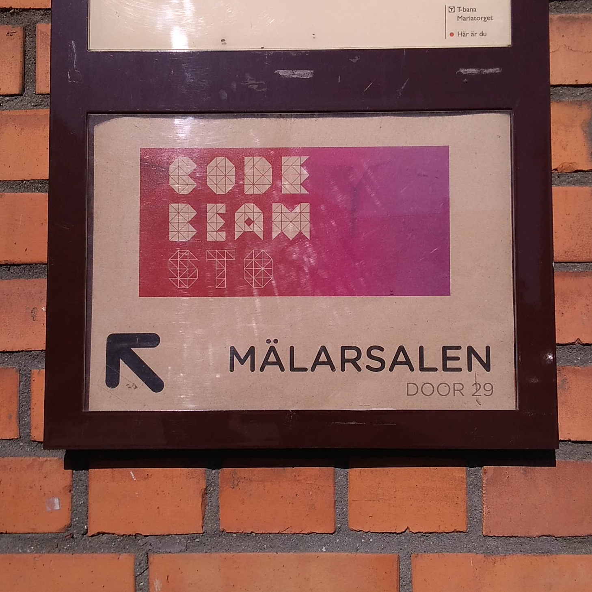
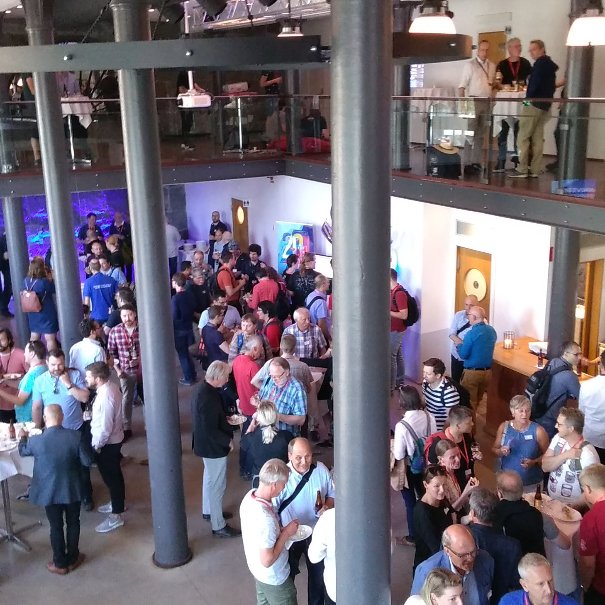
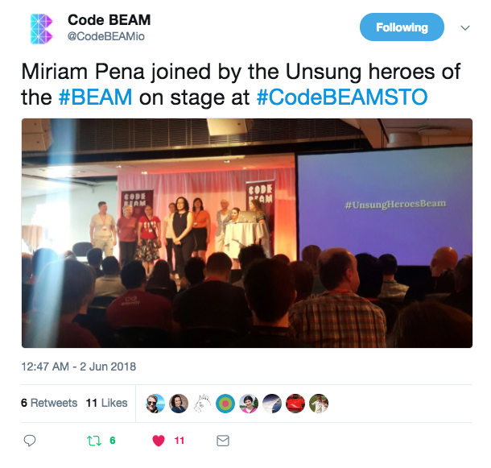
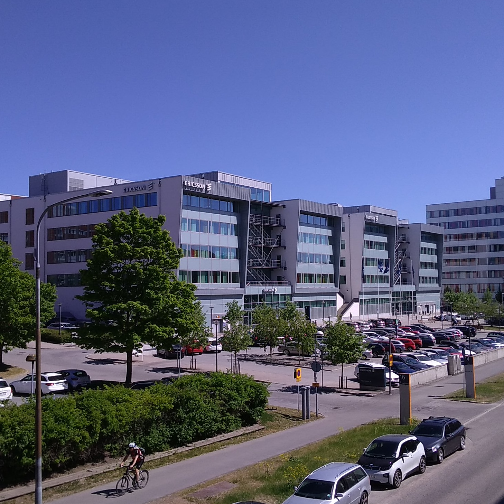
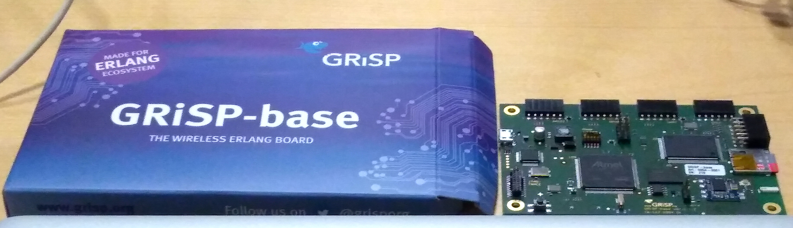
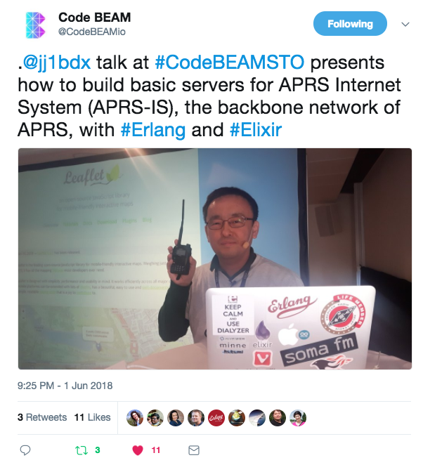

theme: Simple, 2
footer: Kenji Rikitake / fukuoka.ex#11 22-JUN-2018
slidenumbers: true

<!-- Use Deckset 2.0, 4:3 aspect ratio -->

# [fit] CODE BEAM STO 2018 レポート

---

# [fit] 力武 健次
# [fit] りきたけ けんじ

2018年6月22日
fukuoka.ex #11
GMOペパボ福岡オフィス
@jj1bdx
（リモートにて参加）

---

# 2018年5月31日〜6月1日
# [fit] スウェーデンのストックホルムにて
# [fit] Code BEAM STO 2018が開催された

---

---

# Code BEAM STO とは

* Erlang User Conference が元の名前
* 1994年に初めて開催（1996年を除く）
* 1999年以降のproceedingsが残っている
* 2009年以降はErlang Solutionsが開催

---

# なぜ Code BEAM?

* ブランドの付け替え
* Erlangだけではなくなった
* Elixirの台頭
* LFE, efene, Alpaca, clojerl, luerl, erlog
* →BEAMという名前への統合
* （BEAMが浸透しているかどうかは微妙）

---

# 会議のメインテーマ
# [fit] Open Erlang 20周年

---

# Open Erlang 20周年

* 1998年にオープンソース化
* Ericsson内部でのErlang使用禁止令
* 成功するとやっかむ人が出る
* 起死回生策（結果大成功）
* Ericssonを辞めた人はベンチャーへ

---

---

# 会議のその他のテーマ

## [fit] BEAMコミュニティの融合
## [fit] Erlang/OTPの人達とElixirの人達となかよくやっていく
## [fit] 日常としてのダイバーシティ
## [fit] 一例: 多くの女性エンジニアやマネージャーがErlang/OTPの普及に寄与した

---

---

# [fit] 5月30日: 会議前のチュートリアル

## [fit] EricssonのKista（シースタ）オフィス
## 参加無料

---

---

# GRiSPボードのハンズオン

* 組み込み分野への応用
* https://www.grisp.org/
* Erlang/OTPがそのまま走る
* シングルユーザ/マルチタスク
* Erlangでデバイスポートが叩ける

---

# GRiSPボードの写真

* 税抜きでEUR169

---

# [fit] 会議の発表トピック（の一部）

## [fit] 大規模(>1000ノード)クラスタ
## [fit] ブロックチェーン (Aeternity)
## [fit] Gradual Type System
## [fit] Language Server Protocol
## [fit] 学術分野での研究開発事例

---

---

# Erlang/OTPの基本理念

#[fit]Lagom är bäst
#[fit]ほどほどなのが一番良い

---

# ほどほど、とは

#[fit]安全は高速化に優先
#[fit]**手を抜かずに高速化**
#[fit]ケンカしない/させないコミュニティ
#[fit]急がずできることを着実にやっていく

---

# お願い
# [fit] コミュニティに日本の人がいません
# [fit] 日本国外で英語の成果発表を!
# [fit] よろしくお願いします!

---

## [fit] 謝辞
## この講演は
## [fit] GMOペパボ株式会社
## [fit] ペパボ研究所の
## [fit] ご支援で実現しました
## [fit] ありがとうございます

---

# [PR]
# [fit] 力武健次技術士事務所では
# [fit] お仕事募集中です
# [fit] ご相談歓迎致します
# [fit] <https://rikitake.jp/>

---

# [fit] ありがとうございました
# [fit] ご質問をどうぞ

---

[.autoscale: true]

# 写真等クレジット

* Title: [Sebastian Spindler](https://unsplash.com/photos/yaheDIXiuAU) on Unsplash.com
* ペパボ研究所ロゴ: GMOペパボ株式会社

<!--
Local Variables:
mode: markdown
coding: utf-8
End:
-->
